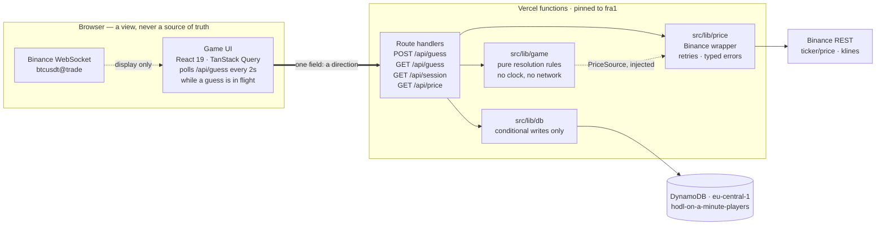
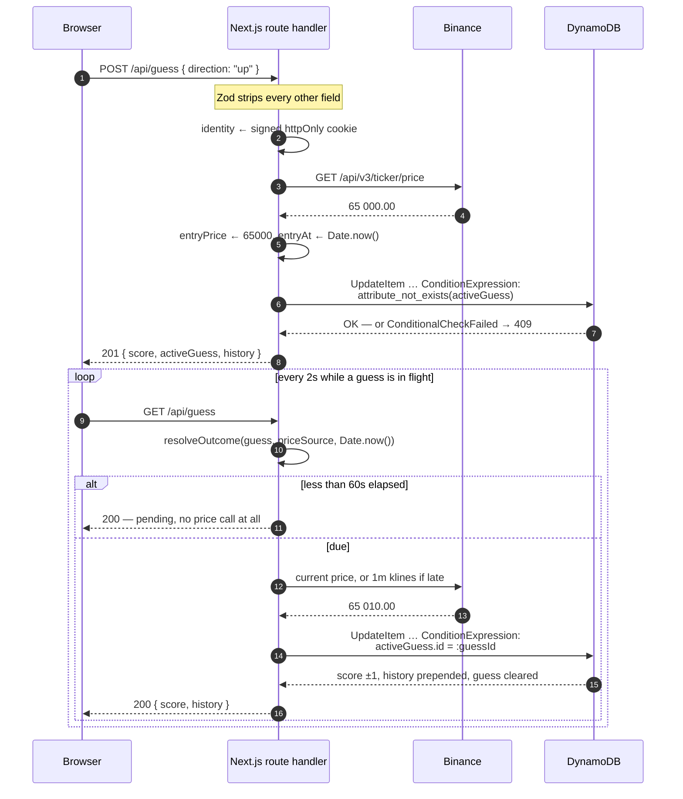
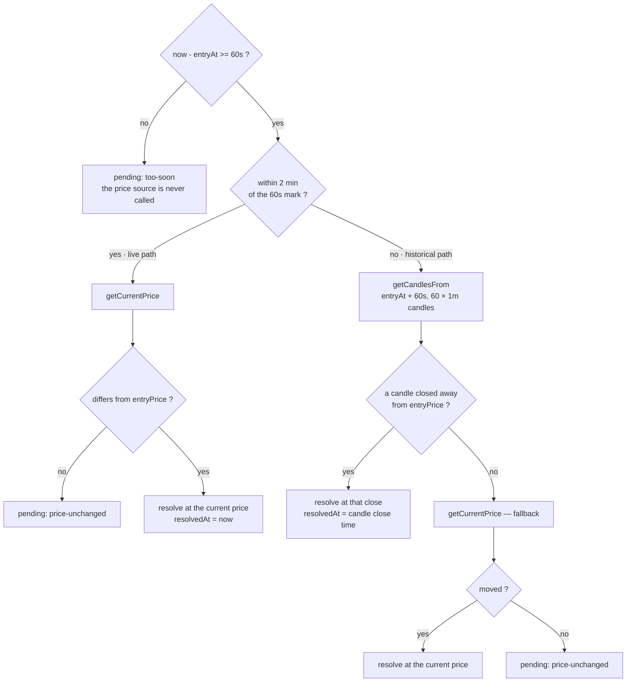

# HODL On A Minute

_A 60-second BTC prediction game._

Guess whether BTC/USD will be higher or lower one minute from now. A correct guess is
+1 point, a wrong one −1. One guess at a time; your score survives closing the browser.

**Live demo:** <https://hodl-on-a-minute.vercel.app/> · **Region:** `fra1` / `eu-central-1` ·
**CI:** lint, types and tests on every push.

---
## Contents

- [The problem, honestly stated](#the-problem-honestly-stated)
- [Architecture](#architecture)
- [The fairness model](#the-fairness-model)
- [Resolving a guess](#resolving-a-guess)
- [Data model](#data-model)
- [API surface](#api-surface)
- [Failure modes](#failure-modes)
- [The interface](#the-interface)
- [Getting started](#getting-started)
- [Environment](#environment)
- [Infrastructure and deployment](#infrastructure-and-deployment)
- [Testing](#testing)
- [Known limitations](#known-limitations)
- [Agent tooling](#agent-tooling)

---

## The problem, honestly stated

The game is four lines of rules and one hard constraint. The rules: pick a direction,
wait sixty seconds, win a point or lose one, and never have two guesses in flight. The
constraint is that **the browser is an adversary**. Anything the client is allowed to
send, the client can lie about — and every value in this game is worth lying about. An
entry price is a free win. A timestamp is a free win. A player id is somebody else's
score.

So the whole design reduces to one sentence: _the client sends a direction and nothing
else_. Every other value — the price, both timestamps, the identity, the score — is
produced on the server or read from the database. What follows is that sentence, worked
out in code.

The second difficulty is quieter and shows up in the resolution logic: a wrong comparator
does not crash. It produces a game that runs perfectly and cheats. That is why
[`src/lib/game/`](src/lib/game/) contains pure functions only — no clock, no network, no
SDK — and why the tests there are the ones worth reading first.

## Architecture



The thick arrow is the whole client-to-server contract. Everything the game is scored on
— both prices, both timestamps, the identity, the score — is produced to the right of it.

The dashed feed into the UI is the Binance trade stream, which exists so the displayed
number moves smoothly and can never influence a score: a browser that tampers with it
changes its own display and nothing else. `GET /api/price` is the server-side fallback for
that same display when the socket is blocked.

There is **no scheduler and no background worker**. Resolution is lazy: a due guess
settles the next time anyone reads it, inside `GET /api/guess`. That is what lets a
player close the browser for three days and still get a fair answer when they come back,
and it is why the client's only job is to poll one endpoint.

### A round, end to end



### Where the code lives

| Path                                            | Holds                                                                     | Rule it obeys                                              |
| ----------------------------------------------- | ------------------------------------------------------------------------- | ---------------------------------------------------------- |
| [`src/lib/game/`](src/lib/game/)                 | `canResolve`, `computeDelta`, `resolveOutcome`                             | Pure. Time and prices arrive as arguments.                  |
| [`src/lib/price/`](src/lib/price/)               | Binance REST wrapper, retry policy, `PriceSource` interface                | Typed errors. Never returns a fabricated number.            |
| [`src/lib/db/`](src/lib/db/)                     | DynamoDB document client, conditional writes, error classification         | Every write is conditional.                                 |
| [`src/lib/session/`](src/lib/session/)           | HMAC token, cookie plumbing                                                | Identity is read from the cookie and nowhere else.          |
| [`src/lib/api/`](src/lib/api/)                   | The `GameState` projection, the shared 503 helper                          | The wire shape is declared, not leaked from the table.      |
| [`src/app/api/`](src/app/api/)                   | Four route handlers                                                        | Zod at the boundary; typed errors mapped to status codes.   |
| [`src/components/game/`](src/components/game/)   | `GameBoard` and friends                                                    | Pure functions of props — `now` is passed in.               |
| [`src/hooks/`](src/hooks/)                       | `useGame`, `useLivePrice`, `useNow`                                        | All fetching and all clocks live here.                      |

## The fairness model

Five invariants. They are written out in full in
[`.claude/skills/fairness-invariants/SKILL.md`](.claude/skills/fairness-invariants/SKILL.md)
and enforced in the code below.

### I1 — the client never supplies a price or a timestamp

The request schema is one field, and Zod's default of stripping unknown keys is
load-bearing:

```ts
// src/app/api/guess/route.ts
const guessRequestSchema = z.object({
  direction: z.enum(["up", "down"]),
});
```

A client that posts `{ direction: "up", price: 1, entryAt: 0, score: 9999 }` has all three
extras dropped before the handler sees them. The guess is then built server-side, _after_
parsing:

```ts
const guess: ActiveGuess = {
  id: randomUUID(),
  direction: parsed.data.direction,
  entryPrice: await getCurrentPrice(), // Binance, server-side
  entryAt: Date.now(),                 // server clock
};
```

There is no moment at which a client-supplied value could reach either field. A `price` or
`entryAt` appearing in that schema would be a design bug, not a feature — and
[the most valuable test in the project](src/tests/guess-route.integration.test.ts#L129)
posts exactly that body and asserts the stored item ignored it.

### I2 — identity comes from a signed httpOnly cookie

Identity determines the score, so it is server data. The cookie `hodl_player` holds
`<playerId>.<HMAC-SHA256(playerId, COOKIE_SECRET)>`, base64url. On every request the
signature is verified with `timingSafeEqual`; a tampered, truncated or unsigned value
yields `null`, and the caller is then issued a **new** player rather than the claimed one.
Failing open to the claimed id would defeat the point of signing.

`httpOnly` means a console one-liner cannot swap identities. `secure` is switched off
outside production, or the cookie is silently dropped over plain-http localhost.
`sameSite: "lax"`, path `/`, one-year lifetime — which is what satisfies "close the
browser and come back".

No `localStorage`, no player id in a body, a query string or a custom header. Anywhere.

### I3 — "one guess at a time" is a database constraint

Not an `if`. Two concurrent requests walk straight through
`if (player.activeGuess) throw`, and a double-click is exactly two concurrent requests.

```ts
// src/lib/db/players.ts — createGuess
ConditionExpression: "attribute_exists(#playerId) AND attribute_not_exists(#activeGuess)",
```

Both halves are needed: `attribute_not_exists(activeGuess)` alone is also true of an item
that does not exist at all, which would create a player carrying a guess and no score. A
failed condition surfaces as `GuessAlreadyActiveError` and becomes **409** — which is not
really a failure, just a lost race.

### I4 — resolution is idempotent

```ts
// src/lib/db/players.ts — resolveGuess
UpdateExpression:
  "SET #score = #score + :delta, " +
  "#history = list_append(:result, if_not_exists(#history, :empty)), " +
  "#updatedAt = :now REMOVE #activeGuess",
ConditionExpression: "#activeGuess.#id = :guessId",
```

One atomic update conditioned on the guess id. Two concurrent readers both compute the
same outcome; the first one's update removes `activeGuess`, so the second one's condition
fails — and the score moves, and the history grows, exactly once. The loser gets
`GuessAlreadyResolvedError`, and the route answers **200** after a re-read, because the
work _was_ done and the player has no reason to see an error.

`list_append(:result, history)` puts the new entry first, so the list is newest-first and
the UI never reverses it. `if_not_exists` covers the player's very first resolution.

### I5 — a guess resolves only when both conditions hold

At least 60 seconds have passed **and** the price has changed. Never resolve arbitrarily
to unblock a player:

```ts
export function canResolve(args: {
  entryAt: number; now: number; entryPrice: number; currentPrice: number;
}): boolean {
  return hasWaitedLongEnough(args.entryAt, args.now) &&
         args.currentPrice !== args.entryPrice;
}
```

Named arguments rather than four positional numbers: `(entryAt, now, entryPrice,
currentPrice)` is four values of the same type in a row, and swapping a pair is the kind
of bug that never throws. `computeDelta` refuses an unchanged price rather than defaulting
— there is no honest answer to "did it go up?" when it did not move, and silently picking
one would make the game wrong in a way no player could ever see.

Exactly 60 seconds counts (`>=`), and the smallest possible move scores. There is no
threshold and no dead band.

## Resolving a guess

`resolveOutcome` picks one of two paths based on how late the read is.



**Why two paths.** Inside the live window the player is almost certainly still watching,
so the current price is both correct and the number on their screen. Past it they were
away, and resolving a three-day-old guess against today's price would satisfy the letter
of the rule while betraying it. The historical path reads the first 1-minute candle after
the 60-second mark whose close differs from the entry price — the price that _was_ true a
minute after they guessed. This is what makes "close your browser and come back" fair
rather than merely functional.

The constants, all in [`src/lib/game/resolve.ts`](src/lib/game/resolve.ts):

| Constant                     | Value  | Why                                                                       |
| ---------------------------- | ------ | ------------------------------------------------------------------------- |
| `RESOLUTION_DELAY_MS`        | 60 000 | The rule.                                                                 |
| `LIVE_WINDOW_MS`             | 120 000| How long the current price still represents what the player was watching.  |
| `HISTORICAL_LOOKUP_CANDLES`  | 60     | One hour. Bounded on purpose — no open-ended scan into the past.           |

**The Binance trap that shaped this code.** `GET /api/v3/klines` rounds `startTime` **up**
to the next boundary, so a mid-candle value silently skips the candle containing it. Left
unfloored, resolution at `entryAt + 60s` would read a candle a full minute late. That is a
fairness bug no unit test with a fake price source can catch, because it lives in the
remote API's semantics — hence `floorToMinute`, [a test that asserts the outgoing
`startTime`](src/tests/binance.test.ts#L154), and a comment saying it was verified against
the live API. Two other easy-to-miss details from the same endpoint: prices come back as
**strings**, and index **4** of a kline is the close, not the open.

**When the price cannot be read, nothing resolves.** `PriceUnavailableError` propagates
out of the game logic untouched, and the route leaves the guess pending. Resolving on a
price we could not read would be the one unforgivable bug in this app.

## Data model

One table, one item per player. No `guesses` table — see
[known limitations](#known-limitations) for the trade that buys.

```
hodl-on-a-minute-players     PK: playerId (S)     PAY_PER_REQUEST
```

```ts
type PlayerItem = {
  playerId: string;              // UUID, minted server-side, mirrors the cookie
  score: number;                 // may be negative
  activeGuess?: ActiveGuess;     // absent ⇒ free to guess. Its absence *is* the lock.
  history?: LastResult[];        // resolved guesses, newest first
  createdAt: number;
  updatedAt: number;
};

type ActiveGuess = {
  id: string;                    // resolution is conditioned on this ⇒ idempotent
  direction: "up" | "down";
  entryPrice: number;            // Binance, server-side
  entryAt: number;               // server clock, epoch ms
};

type LastResult = {
  direction: "up" | "down";
  entryPrice: number;
  resolvedPrice: number;
  delta: 1 | -1;
  resolvedAt: number;            // candle close time on the historical path
};
```

Three properties of this shape are deliberate:

- **The lock is the absence of an attribute.** `activeGuess` present means locked, and
  DynamoDB can test that atomically. No separate `status` field to fall out of sync.
- **The history rides on the same item.** Prepending it inside the resolving write means
  one item, one atomic update — the idempotence guarantee is untouched. A second table
  would need a DynamoDB transaction to keep the same property.
- **Reads that matter are strongly consistent.** `getPlayer` passes
  `ConsistentRead: true`; a stale read could resolve a guess another request already
  resolved.

`getOrCreatePlayer` reads first — the returning player is the common case and costs one
call — then creates conditionally on `attribute_not_exists(playerId)`. Two first-ever
requests racing produce one player, and the loser simply re-reads.

The wire shape is a **projection**, not the raw item
([`src/lib/api/game-state.ts`](src/lib/api/game-state.ts)), so adding a column to the
table never accidentally becomes a change to the public API. Responses carry at most
`HISTORY_PAGE_SIZE = 20` history entries.

## API surface

Every route returns `GameState` unless stated otherwise. None of them accepts a player id,
a price or a timestamp.

| Route              | Body            | Success | Other outcomes                                                                 |
| ------------------ | --------------- | ------- | ------------------------------------------------------------------------------ |
| `GET /api/session` | —               | 200     | 503 store unavailable. Mints the identity and sets the cookie on first sight.   |
| `POST /api/guess`  | `{ direction }` | 201     | 400 malformed body · 409 a guess is already in flight · 503 price or store down |
| `GET /api/guess`   | —               | 200     | 503 store unavailable. Resolves the active guess first if it is due.            |
| `GET /api/price`   | —               | 200 `{ price }` | 503 price unavailable                                                   |

```jsonc
// 200 GET /api/guess
{
  "playerId": "6f1c…",
  "score": 3,
  "activeGuess": { "id": "9ab…", "direction": "up", "entryPrice": 65000, "entryAt": 1754812800000 },
  "history": [ { "direction": "down", "entryPrice": 64980, "resolvedPrice": 64950, "delta": 1, "resolvedAt": 1754812740000 } ],
  "priceUnavailable": true // only when Binance could not be reached; the guess stays pending
}
```

`GET /api/session` exists as the read that **never** resolves anything, as opposed to
`GET /api/guess`. A client that wants the state without triggering a resolution asks
there.

## Failure modes

The recurring distinction: _"we know, and the answer is no"_ must never be confused with
_"we do not know"_. The second one always leaves the guess pending.

| What breaks                | Classified as               | The player sees                                                            |
| -------------------------- | --------------------------- | -------------------------------------------------------------------------- |
| Binance 5xx or timeout     | `PriceUnavailableError`     | On POST: 503 with `Retry-After: 5`. On GET: **200** with `priceUnavailable` — the state is still worth reading and the guess is intact. |
| Binance 4xx / 429 / 418    | `PriceUnavailableError`, not retried | Same, but no retry storm: a 4xx is our bug, and retrying into a rate limit makes it worse. |
| DynamoDB throttled, 5xx, gone | `DataStoreUnavailableError` | 503. There is no state to return at all, so the caller is told to come back. |
| The $1 cost breaker fires  | `DataStoreUnavailableError` | 503. `AccessDeniedException` is treated as weather because the breaker re-arms itself — and a denied request never reaches DynamoDB, so retrying is free. |
| Bad AWS credentials        | passed through → 500        | Deliberate. `UnrecognizedClientException` means the deployment is misconfigured; that should stay loud, not look like weather. |
| A malformed request body   | 400                         | Rejected before it touches the store or Binance.                            |
| The Binance WebSocket dies | not an error                | The badge turns amber and the client polls `/api/price` instead. The game stays playable. |

Retries on the price side: 3 attempts, 150 ms then 400 ms, 5-second timeout per request,
and only transport failures and 5xx are retried
([`src/lib/price/binance.ts`](src/lib/price/binance.ts)).

503 rather than 500 throughout, with `Retry-After`. 500 says "we have a bug"; 503 says
"the request was fine, a dependency was not". The player gets something actionable, and we
do not get paged for someone else's outage.

## The interface

Dark, two columns on a wide screen — the market and the act of playing on the left, the
record of past guesses on the right — stacking market-first on a narrow one.

- **`GameBoard` is a pure function of its props.** `now` arrives as a number from
  `useNow()`, so every state the player can reach — counting down, waiting for a move,
  just won, just lost, feed degraded — is reachable in a test by passing different props.
  No fake timers anywhere in the UI suite.
- **The clicked direction lights up immediately**, from TanStack Query's `variables`,
  rather than a round-trip later. Three button states and only three: `idle`, `chosen`
  (full colour, ringed, fill draining left-to-right as the minute runs out) and `dimmed`
  (the road not taken, stripped of colour so it reads as unavailable rather than as a
  second live option).
- **The price tint shows the current state of the market, never a flash per tick.** The
  tension should come from the game, not from the interface shouting. Exactly on the entry
  price, it stays untinted.
- **The feed badge tells the truth.** Green and pulsing only when genuinely streaming from
  Binance; amber for the 3-second server fallback or while connecting; red when nothing
  answers. A green light on a degraded feed teaches the player to distrust the whole
  display. `motion-safe:` so a reduced-motion preference gets a steady dot rather than
  none.
- **The trace is fed only by the stream**, sampled every 500 ms over a 2-minute window.
  When the socket dies the line stops growing rather than continuing at the fallback's
  coarse granularity — a 3-second line drawn as if it were live would misrepresent the
  data. The chart is `aria-hidden`; the numbers above it say the same thing.
- **Polling is proportional to interest**: 2 seconds while a guess is in flight, nothing
  at all when the player is idle.

## Getting started

Node 20. Running locally needs **no AWS account**: the data layer talks to DynamoDB Local,
which speaks the same API. Docker must be running.

```bash
npm install
cp .env.example .env.local   # see the file for the DynamoDB Local values
npm run db:local:up          # start the container
npm run db:local             # create the table (in-memory: re-run after a restart)
npm run dev
```

Leave `DYNAMODB_ENDPOINT` empty to talk to real AWS instead — the real regional endpoint
is what you get by default, never something you must remember to switch back to.

| Command                 | What it does                                    |
| ----------------------- | ----------------------------------------------- |
| `npm run dev`           | Dev server on :3000                             |
| `npm run build`         | Production build                                |
| `npm run lint`          | ESLint                                          |
| `npm run typecheck`     | `tsc --noEmit`                                  |
| `npm test`              | Vitest, single run                              |
| `npm run test:coverage` | Vitest with coverage, scoped to the critical libs |
| `npm run check`         | lint + typecheck + tests, in order              |
| `npm run db:local:up`   | Start (or restart) the DynamoDB Local container  |
| `npm run db:local`      | Create the table in DynamoDB Local               |

## Environment

Validated once, lazily, with Zod ([`src/lib/env.ts`](src/lib/env.ts)) — lazily because
`next build` imports these modules without the runtime environment, and a top-level throw
would turn a missing variable into a failed build instead of a clear runtime error.

| Variable                | Required | Notes                                                                     |
| ----------------------- | -------- | ------------------------------------------------------------------------- |
| `AWS_REGION`            | yes      | `eu-central-1` in production.                                             |
| `AWS_ACCESS_KEY_ID`     | yes      | The `hodl-app` user. DynamoDB Local accepts anything but partitions data by key. |
| `AWS_SECRET_ACCESS_KEY` | yes      |                                                                           |
| `DYNAMODB_TABLE`        | yes      | `hodl-on-a-minute-players`.                                               |
| `DYNAMODB_ENDPOINT`     | no       | Local development only. An **empty** value counts as absent, so `DYNAMODB_ENDPOINT=` in a `.env` file is ignored rather than rejected. |
| `COOKIE_SECRET`         | yes      | ≥ 32 chars. `openssl rand -base64 32`. Rotating it invalidates every identity. |

`.env` is never committed — this repo is public.

## Infrastructure and deployment

Provisioned and verified end to end: a guess placed in the browser is priced from Binance
server-side, written to DynamoDB in `eu-central-1`, and resolved sixty seconds later
against a fresh price — with the application authenticating as an identity that can do
three things and nothing else.

**One table, on-demand.** `hodl-on-a-minute-players`, partition key `playerId`,
`PAY_PER_REQUEST` billing. It is the same schema
[`scripts/create-local-table.mjs`](scripts/create-local-table.mjs) creates, so DynamoDB
Local and the real service are interchangeable: the only thing that differs between them
is `DYNAMODB_ENDPOINT`.

**Two identities, split by purpose.** Provisioning ran under an administrator user whose
access keys were deleted once the resources existed — the identity remains, it simply has
no credentials left to use. The application authenticates as `hodl-app`, whose inline
policy allows exactly `GetItem`, `PutItem` and `UpdateItem` on that single table's ARN.
Not `dynamodb:*`, not `Resource: "*"`, and deliberately no `Scan` — which is what makes
the "no leaderboard" limitation below an actual constraint rather than a stylistic
preference. The root account carries a WebAuthn passkey for MFA and holds no access keys.

The boundary is verified by **calling** it rather than by reading the policy document: an
inline policy can be correct while a managed policy attached alongside it widens the blast
radius. [`.claude/commands/deploy-check.md`](.claude/commands/deploy-check.md) runs four
calls under `hodl-app`'s own credentials — one that must succeed and three that must be
denied.

**Cost control is layered, because AWS has no hard spending cap.** Three layers, in
increasing order of severity: a zero-spend budget that emails on the first cent, Free Tier
and CloudWatch billing alerts, and a $1 monthly budget whose action automatically attaches
an explicit `Deny` on `dynamodb:*` to `hodl-app`. That last one takes the demo down rather
than let a bill run — the right trade for a portfolio deployment. The applied policy is
detached automatically at the start of each budget period, so the breaker re-arms itself
instead of needing to be replaced.

Two honest caveats on that breaker. Budget actions are evaluated against cost data that
lags by hours, so it is a slow fuse, not a cap: spend can accrue past the threshold before
it fires. And IAM denials do not apply to the root user, which is precisely why root MFA
is not optional here.

**The deployment region is pinned to Frankfurt, and not for latency reasons alone.**
Binance answers `451 Unavailable For Legal Reasons` to requests from US IP addresses, and
Vercel's default function region is `iad1`, in Washington. Every guess on the first
deployment therefore failed with a 503 — correctly, since `isRetryableStatus` retries only
5xx and a 451 is a jurisdiction, not a hiccup. Pinning the functions to `fra1` in
[`vercel.json`](vercel.json) fixes it, and lands them in `eu-central-1`: the same region as
the table, so every DynamoDB call is intra-region instead of transatlantic. Keeping the
region in the repository rather than only in the dashboard means it survives the project
being recreated, and is visible to anyone reading the code.

**The account is on pay-as-you-go rather than the credit-limited free plan.** The free plan
cannot be billed but expires on a fixed date, which would quietly kill the public demo.
Expected cost is nil either way: this workload sits several orders of magnitude inside
DynamoDB's permanent free allowance, so the budget guards against mistakes, not against
normal operation.

**CI** runs on every push to every branch ([`.github/workflows/ci.yml`](.github/workflows/ci.yml)):
lint, `next typegen`, typecheck, then the full test suite against a DynamoDB Local service
container — including the concurrency and fairness tests, which are refused the right to
skip there (see [Testing](#testing)). The typegen step is not optional — `layout.tsx`
uses `LayoutProps`, which Next generates into the git-ignored `.next/types`, and on a
clean checkout typechecking fails before reaching a line of our own code.

## Testing

Coverage is reported on [`src/lib/game/`](src/lib/game/),
[`src/lib/price/`](src/lib/price/) and [`src/lib/db/`](src/lib/db/) specifically, rather
than on the whole app, so the number means something instead of being diluted by UI and
config files. Global coverage is not a goal here.

**Priority order, deliberately:**

1. **`canResolve` and `computeDelta` edge cases.** 59 s with a moved price is pending;
   exactly 60 s resolves; past 60 s with an unchanged price stays pending; the smallest
   possible move scores; an unchanged price throws rather than defaulting to a direction.
2. **Historical resolution.** Candles are read from the 60-second mark and not from now;
   the window is bounded; candles that closed at the entry price are skipped; an hour of
   identical closes falls back to the current price; even the fallback can leave the guess
   pending.
3. **The concurrency guarantees, against a real DynamoDB.** Two genuinely concurrent
   `createGuess` calls produce one guess; two concurrent resolutions move the score once;
   the history stays newest-first. These run against DynamoDB Local because a mocked
   client would only prove that we _pass_ a `ConditionExpression`, never that it holds
   under a race.
4. **The test that a client-supplied `price` is ignored.** It posts
   `{ direction: "up", price: 1, entryAt: 0, score: 9999 }`, then asserts on the **stored
   item** — not just the response — that the entry price is the server's, the timestamp is
   the server clock, and the score is still 0. It documents a security decision at the
   same time as it verifies it. If it ever fails, the game is riggable from the browser
   console.

Also covered: the signed-token suite (forged signatures, wrong secret, wrong length,
separator inside the id), the Binance wrapper (string prices, index 4, retry policy,
`startTime` flooring, unknown trailing fields), the store-failure classification (what is
weather and what is our bug), and the UI states.

The two integration suites **skip themselves** when nothing answers on
`DYNAMODB_ENDPOINT`, so `npm test` stays green on a machine without the container. To run
them locally:

```bash
npm run db:local:up && npm test
```

That ergonomics stops at the edge of a developer's terminal. A skip is invisible in a
green check, so **CI is not allowed one**: the workflow runs DynamoDB Local as a service
container, waits for the port, and sets `REQUIRE_DYNAMODB=1` — which turns "no container
here" from a skip into a failed run. On top of it, `npm run test:ci` fails on _any_
skipped test, including an `it.skip` left behind in a commit
([`scripts/assert-no-skipped-tests.mjs`](scripts/assert-no-skipped-tests.mjs)). Vitest
already covers the symmetrical mistake, since `allowOnly` defaults to `!CI` and a stray
`it.only` therefore fails CI on its own. Green on this repo means 126 tests ran, not 112.

The emulator, rather than real AWS, is a deliberate line: it is the same conditional-write
engine, it needs no credentials in CI, and it works on pull requests from forks. What it
cannot prove is IAM, region and credential wiring — which is why that boundary is verified
separately by calling it, in [`deploy-check`](.claude/commands/deploy-check.md).

Only two things are faked in the route tests: the cookie store, because `next/headers`
needs a request scope that does not exist outside a server, and the price source, so the
numbers are known. The database is real.

One note for the walkthrough: `canResolve` states the rule in isolation and is what the
unit tests exercise, while `resolveOutcome` — which the route actually calls — expresses
the same two conditions along the paths it has to branch through. The predicate is kept as
the readable statement of the rule; if the two ever disagree, the tests on `resolveOutcome`
are the ones that matter.

## Known limitations

Everything here is a deliberate trade, not an oversight. Each one names what production
would do instead.

**Guess history is bounded by the item, not by a table.** Resolved guesses are prepended to
a `history` list on the player item, inside the same conditional write that resolves them
— one item, one atomic update, so resolution stays idempotent. The cost is that DynamoDB
cannot trim a list server-side, and appending to plus removing from the same attribute in
one expression is rejected as overlapping paths. Bounding the list would therefore mean a
second write on every resolution. Instead the ceiling is accepted: at roughly 100 bytes an
entry, the 400 KB item limit lands near 4,000 guesses — about 66 hours of uninterrupted
play. API responses are capped independently at 20 entries, so the payload is bounded even
though the item is not. In production this is where an append-only `guesses` table with a
TTL belongs, written through a DynamoDB transaction.

**A flat market leaves a guess pending indefinitely.** "The price must have changed" is
part of the brief, and BTC/USD moving not at all for an hour is close to unheard of — but
the state is reachable, and the honest answer is that the guess stays open and the player
stays locked. The alternative, resolving on an unchanged price, would have to invent a
direction. The UI says what it is waiting for rather than pretending to count down.

**Clearing cookies starts a new player.** Identity is a signed httpOnly cookie, not an
account. The brief asked for persistence across browser restarts, which this satisfies;
real accounts would need authentication, which it did not ask for. Rotating
`COOKIE_SECRET` has the same effect on everyone at once.

**No leaderboard and no other-player activity.** Listing active guesses across players
would need either a `Scan` — which the IAM policy deliberately excludes — or a sparse GSI
keyed on a "guess in flight" attribute. The latter is the right design and is what
production would use; it is out of scope here, and a live activity feed on a single-player
deployment would show an empty list anyway.

**The price stream is display-only.** The browser reads Binance over a WebSocket for a
smooth ticker. No guess is ever priced from it: entry, resolution and timestamps are all
fetched server-side.

**There is no rate limiting.** A scripted client can hammer `GET /api/guess`. It cannot
place two guesses — DynamoDB refuses — and it cannot win anything it would not otherwise
win, so the exposure is cost rather than fairness, and the budget breaker is the backstop.
Production would put a limiter in front of the routes, keyed on the same cookie.

**Resolution is lazy, so a guess settles only when someone reads it.** A player who never
returns has a guess that is never resolved and a score that never moves. That is the
correct behaviour for this design — the answer they eventually get is computed from the
candle that was true a minute after they guessed, not from whenever they happened to come
back — but it does mean the database holds open guesses indefinitely. A scheduled sweep
would only change when the write happens, not the outcome.

**`entryAt` is stamped just after the entry price is read**, not at the same instant: the
Binance round-trip sits between them. The gap is tens of milliseconds, both values are
server-side, and it can only make the player wait marginally longer than 60 seconds from
the observed price — never less.

**One symbol, one interval, one region.** BTC/USDT on Binance, 1-minute candles,
`eu-central-1`. Multi-region, multi-asset and a provider-agnostic price abstraction are all
out of scope; the `PriceSource` interface is the seam where a second provider would go.

**Trusting Binance's clock and ours to agree.** `entryAt` comes from the server clock and
candles are keyed by Binance's. A meaningful skew would shift which candle a late
resolution reads. Vercel's clocks are NTP-disciplined and the candle is a full minute
wide, so the risk is theoretical — but it is the kind of thing worth naming rather than
discovering.

## Agent tooling

This repo versions its coding-agent configuration under `.claude/`, the same way it
versions ESLint and CI config. Three agents with narrow scopes, four commands, three
packaged skills. `CLAUDE.md` holds the invariants that must never be violated — chiefly
that the client never supplies a price or a timestamp. See
[`.claude/README.md`](.claude/README.md) for the rationale behind each one, including the
agents that were deliberately **not** created.
