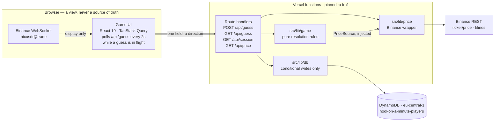

<!-- Deliberately no `align` on the mark: GitHub strips `style`, and of the legacy
     values `top` hangs the tile above the cap height while `middle` drops it
     through the rule under the heading. Baseline is the one that lands. -->

#  HODL On A Minute

_A 60-second BTC prediction game._

Guess whether BTC/USD will be higher or lower one minute from now. A correct guess is
+1 point, a wrong one −1. One guess at a time; your score survives closing the browser.

**Live demo:** <https://hodl-on-a-minute.vercel.app/> · **Region:** `fra1` / `eu-central-1` ·
**CI:** lint, types and tests on every push.

## The one hard constraint

The rules are four lines. The difficulty is that **the browser is an adversary**, and every
value in this game is worth lying about: an entry price is a free win, a timestamp is a
free win, a player id is somebody else's score.

So the design reduces to one sentence — **the client sends a direction and nothing else.**
Every other value is produced on the server or read from the database.

The second difficulty is quieter: in resolution logic, a wrong comparator does not crash.
It produces a game that runs perfectly and cheats. Hence [`src/lib/game/`](src/lib/game/) —
pure functions, no clock, no network, no SDK — and the tests there are the ones worth
reading first.

## Architecture



The thick arrow is the whole client-to-server contract. Everything the game is scored on is
produced to the right of it. The dashed feed is display only — a browser that tampers with
it changes its own screen and nothing else.

There is **no scheduler and no background worker**. Resolution is lazy: a due guess settles
the next time anyone reads it, inside `GET /api/guess`. That is what lets a player close
the browser for three days and still get a fair answer.

| Path | Holds | Rule it obeys |
| --- | --- | --- |
| [`src/lib/game/`](src/lib/game/) | `canResolve`, `computeDelta`, `resolveOutcome` | Pure. Time and prices arrive as arguments. |
| [`src/lib/price/`](src/lib/price/) | Binance wrapper, retry policy, `PriceSource` | Typed errors. Never a fabricated number. |
| [`src/lib/db/`](src/lib/db/) | Conditional writes, error classification | Every write is conditional. |
| [`src/lib/session/`](src/lib/session/) | HMAC token, cookie plumbing | Identity comes from the cookie, nowhere else. |
| [`src/app/api/`](src/app/api/) | Four route handlers | Zod at the boundary; typed errors → status codes. |
| [`src/components/game/`](src/components/game/) | `GameBoard` and friends | Pure functions of props — `now` is passed in. |

## The fairness model

Five invariants, stated in full in
[`fairness-invariants`](.claude/skills/fairness-invariants/SKILL.md).

**I1 — the client never supplies a price or a timestamp.** The request schema is one field,
and Zod's default of stripping unknown keys is load-bearing. The guess is built _after_
parsing, from `getCurrentPrice()` and `Date.now()` on the server
([`route.ts`](src/app/api/guess/route.ts)). A `price` field appearing in that schema would
be a design bug, not a feature.

**I2 — identity is a signed httpOnly cookie.** `<playerId>.<HMAC-SHA256>`, verified with
`timingSafeEqual`. A tampered, truncated or unsigned value yields `null`, and the caller is
issued a **new** player rather than the claimed one — failing open would defeat the point
of signing ([`token.ts`](src/lib/session/token.ts)).

**I3 — "one guess at a time" is a database constraint, not an `if`.** Two concurrent
requests walk straight through `if (player.activeGuess) throw`, and a double-click is
exactly two concurrent requests. `attribute_exists(#playerId) AND
attribute_not_exists(#activeGuess)` — both halves needed, since the second alone is also
true of an item that does not exist ([`players.ts`](src/lib/db/players.ts)).

**I4 — resolution is idempotent.** One atomic update conditioned on the guess id. Two
concurrent readers compute the same outcome; the first removes `activeGuess`, so the
second's condition fails and the score moves exactly once. The loser gets a **200** after a
re-read, because the work _was_ done.

**I5 — a guess resolves only when both conditions hold.** Sixty seconds elapsed **and** the
price changed. `computeDelta` throws on an unchanged price rather than defaulting — there
is no honest answer to "did it go up?" when it did not move. Exactly 60 s counts, the
smallest move scores, no dead band.

## Resolving a guess

`resolveOutcome` takes one of two paths. Inside two minutes of the 60-second mark the
player is almost certainly still watching, so the **current** price is both correct and the
number on their screen. Past that they were away, and resolving a three-day-old guess
against today's price would satisfy the letter of the rule while betraying it — so the
**historical** path reads the first 1-minute candle after `entryAt + 60s` whose close
differs from the entry price. Constants and the full flow:
[`resolve.ts`](src/lib/game/resolve.ts).

**The Binance trap that shaped this code.** `GET /api/v3/klines` rounds `startTime` **up**,
so a mid-candle value silently skips the candle containing it and resolution reads a full
minute late. That is a fairness bug no test with a fake price source can catch, because it
lives in the remote API's semantics — hence `floorToMinute` and [a test asserting the
outgoing `startTime`](src/tests/binance.test.ts). Two more traps from the same endpoint:
prices come back as **strings**, and index **4** of a kline is the close.

**When the price cannot be read, nothing resolves.** `PriceUnavailableError` propagates and
the guess stays pending. Resolving on a price we could not read would be the one
unforgivable bug here.

## Data model

One table, one item per player. No `guesses` table — see [limitations](#known-limitations).

```ts
type PlayerItem = {
  playerId: string;              // UUID, minted server-side, mirrors the cookie
  score: number;                 // may be negative
  activeGuess?: ActiveGuess;     // absent ⇒ free to guess. Its absence *is* the lock.
  history?: LastResult[];        // resolved guesses, newest first
  createdAt: number;
  updatedAt: number;
};
```

Three deliberate properties: the lock **is** the absence of an attribute, so DynamoDB can
test it atomically with no `status` field to fall out of sync; the history rides on the
same item, so prepending it inside the resolving write keeps idempotence; and reads that
matter pass `ConsistentRead: true`. The wire shape is a
[projection](src/lib/api/game-state.ts), not the raw item, capped at 20 history entries.

## API surface

None of these accepts a player id, a price or a timestamp.

| Route | Body | Success | Other outcomes |
| --- | --- | --- | --- |
| `GET /api/session` | — | 200 | 503. Mints the identity on first sight; never resolves anything. |
| `POST /api/guess` | `{ direction }` | 201 | 400 malformed · 409 guess in flight · 503 price or store down |
| `GET /api/guess` | — | 200 | 503. Resolves the active guess first if it is due. |
| `GET /api/price` | — | 200 | 503. Server-side fallback for the display. |

## Failure modes

The recurring distinction: _"we know, and the answer is no"_ must never be confused with
_"we do not know"_. The second always leaves the guess pending.

| What breaks | Classified as | The player sees |
| --- | --- | --- |
| Binance 5xx or timeout | `PriceUnavailableError` | POST → 503. GET → **200** with `priceUnavailable`; the guess is intact. |
| Binance 4xx / 429 / 418 | same, **not retried** | Retrying into a rate limit makes it worse; a 451 is a jurisdiction, not a hiccup. |
| DynamoDB throttled, 5xx, gone | `DataStoreUnavailableError` | 503 with `Retry-After`. |
| The $1 cost breaker fires | `DataStoreUnavailableError` | 503. It re-arms itself, and a denied request never reaches DynamoDB, so retrying is free. |
| Bad AWS credentials | passed through → **500** | Deliberate: a misconfigured deployment should stay loud, not look like weather. |
| The Binance WebSocket dies | not an error | The badge turns amber and the client polls `/api/price`. The game stays playable. |

503 rather than 500 throughout. 500 says "we have a bug"; 503 says "the request was fine, a
dependency was not" ([`errors.ts`](src/lib/db/errors.ts)).

## Getting started

Node 20. Running locally needs **no AWS account** — the data layer talks to DynamoDB Local,
which speaks the same API. Docker must be running.

```bash
npm install
cp .env.example .env.local   # the file documents the DynamoDB Local values
npm run db:local:up          # start the container
npm run db:local             # create the table (in-memory: re-run after a restart)
npm run dev
```

`npm run check` runs lint, typecheck and tests. Leave `DYNAMODB_ENDPOINT` empty to talk to
real AWS — the real endpoint is the default, never something to remember to switch back to.
Variables are validated lazily with Zod ([`env.ts`](src/lib/env.ts)); `.env` is never
committed, this repo is public.

## Infrastructure

**Least privilege, verified by calling it.** The app authenticates as `hodl-app`, whose
inline policy allows exactly `GetItem`, `PutItem` and `UpdateItem` on one table ARN — not
`dynamodb:*`, not `Resource: "*"`, and deliberately no `Scan`, which is what makes "no
leaderboard" a real constraint rather than a preference. The provisioning user's access
keys were deleted once the resources existed. An inline policy can be correct while a
managed policy attached alongside widens the blast radius, so
[`deploy-check`](.claude/commands/deploy-check.md) makes four real calls under those
credentials: one that must succeed, three that must be denied.

**Cost control is layered, because AWS has no hard spending cap.** A zero-spend budget, Free
Tier alerts, and a $1 monthly budget action that attaches an explicit `Deny` on
`dynamodb:*` — taking the demo down rather than letting a bill run. Two honest caveats:
budget actions are evaluated against cost data that lags by hours, so it is a slow fuse and
not a cap; and IAM denials do not apply to the root user, which is why root MFA is not
optional here.

**Frankfurt, and not for latency alone.** Binance answers `451 Unavailable For Legal
Reasons` to US IP addresses, and Vercel's default function region is `iad1`. Every guess on
the first deployment therefore failed — correctly, since only 5xx are retried. Pinning to
`fra1` in [`vercel.json`](vercel.json) fixes it and lands the functions in the table's own
region. Keeping it in the repository means it survives the project being recreated.

## Testing

Coverage is reported on the critical libraries only, so the number means something. Global
coverage is not a goal. In priority order:

1. **`canResolve` and `computeDelta` edge cases** — 59 s pending, exactly 60 s resolves,
   unchanged price pending, smallest move scores, unchanged price throws.
2. **Historical resolution** — candles read from the 60-second mark and not from now, the
   window bounded, entry-price closes skipped.
3. **The concurrency guarantees, against a real DynamoDB.** Two concurrent `createGuess`
   calls produce one guess; two concurrent resolutions move the score once. Against
   DynamoDB Local, because a mocked client would only prove we _pass_ a
   `ConditionExpression`, never that it holds under a race.
4. **[The test that a client-supplied `price` is ignored](src/tests/guess-route.integration.test.ts).**
   It posts `{ direction: "up", price: 1, entryAt: 0, score: 9999 }` and asserts on the
   **stored item** that the entry price is the server's and the score is still 0. It
   documents a security decision at the same time as it verifies it.

Also covered: forged and truncated cookie signatures, the Binance wrapper, the
store-failure classification, and the UI states.

The integration suites **skip themselves** when nothing answers on `DYNAMODB_ENDPOINT`, so
`npm test` stays green without the container. That ergonomics stops at a developer's
terminal: CI sets `REQUIRE_DYNAMODB=1`, which turns a missing container into a failed run,
and `npm run test:ci` fails on _any_ skipped test. Green here means every test ran.

## Known limitations

Each one is a deliberate trade, and names what production would do instead.

**History is bounded by the item, not by a table.** Resolved guesses are prepended inside
the same conditional write that resolves them — one item, one atomic update, so idempotence
is untouched. DynamoDB cannot trim a list server-side, and appending to plus removing from
the same attribute in one expression is rejected as overlapping paths, so bounding it would
cost a second write per resolution. The ceiling is accepted instead: ~4,000 guesses at the
400 KB item limit, about 66 hours of play. Production: an append-only `guesses` table with
a TTL, written through a transaction.

**A flat market leaves a guess pending indefinitely.** "The price must have changed" is
part of the brief. The alternative — resolving on an unchanged price — would have to invent
a direction. The UI says what it is waiting for rather than pretending to count down.

**Clearing cookies starts a new player.** Identity is a signed cookie, not an account. The
brief asked for persistence across browser restarts, not for authentication.

**No leaderboard and no other-player activity.** That needs either a `Scan` — which the IAM
policy excludes — or a sparse GSI keyed on a "guess in flight" attribute. The latter is the
right design and what production would use.

**No rate limiting.** A scripted client can hammer `GET /api/guess`. It cannot place two
guesses and cannot win anything it would not otherwise win, so the exposure is cost rather
than fairness, and the budget breaker is the backstop.

**Resolution is lazy, so a guess settles only when someone reads it.** A player who never
returns leaves an open guess. The answer they would eventually get is computed from the
candle that was true a minute after they guessed, so a scheduled sweep would change when
the write happens, not the outcome.

**One symbol, one interval, one region**, and we trust Binance's clock and ours to agree. A
meaningful skew would shift which candle a late resolution reads; the candle is a full
minute wide, so the risk is theoretical — but worth naming rather than discovering.

## Agent tooling

This repo versions its coding-agent configuration under `.claude/`, the same way it versions
ESLint and CI config. Three agents with narrow scopes, four commands, three packaged skills.
`CLAUDE.md` holds the invariants that must never be violated. See
[`.claude/README.md`](.claude/README.md) for the rationale behind each one — including the
agents deliberately **not** created.
